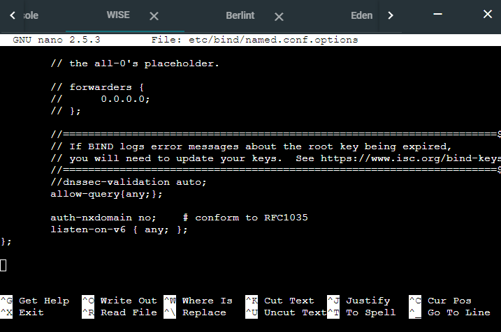
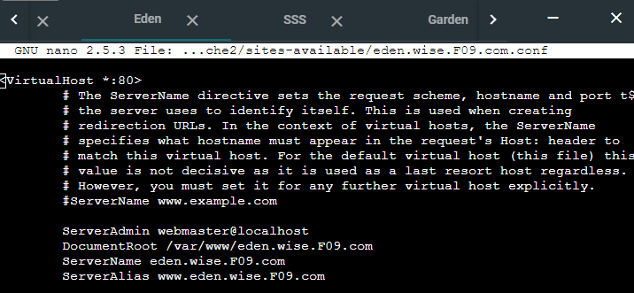

# Jarkom-Modul-2-F09-2022

## Anggota Kelompok

<table>
    <tr>
        <th>NRP</th>
        <th>Nama</th>
    </tr>
    <tr>
        <td>Muhammad Lintang Panjerino</td>
        <td>5025201045</td>
    </tr>
    <tr>
        <td>Sayid Ziyad Ibrahim Alaydrus</td>
        <td>5025201147</td>
    </tr>
    <tr>
        <td>Wahyu Tri Saputro</td>
        <td>5025201217</td>
    </tr>
<table>

## NO 1.

### Semua node terhubung pada router Ostania, sehingga dapat mengakses internet

pertama kita membuat topologi seperti yang ada pada soal.


lalu untuk mengecheck apakah semua node sudah terkoneksi internet , kita dapat mencoba dengan meng-ping google.com.

### wise

### Berlint

### Eden

### SSS

### garden


## NO 2.

### Untuk mempermudah mendapatkan informasi mengenai misi dari Handler, bantulah Loid membuat website utama dengan akses wise.yyy.com dengan alias www.wise.yyy.com pada folder wise.

pertama kita tambahkan 'wise.F09.com' pada file `/etc/bind/named.conf.local`

lalu memodifikasi config pada `/etc/bind/wise/wise.f09.com` Menggunakan NS untuk mendelegasikan zone yang telah dibuat pada wise.F09.com, kemudian domain dipetakan pada IP Eden. lalu menggunakan Cname untuk membuat alias website www.F09.com. berikut adalah hasilnya:


berikut adalah hasilnya setelah dicoba:


## NO 3.
### Setelah itu ia juga ingin membuat subdomain eden.wise.yyy.com dengan alias www.eden.wise.yyy.com yang diatur DNS-nya di WISE dan mengarah ke Eden

Memodifikasi config pada file `/etc/bind/wise/wise.f09.com`. Menggunakan NS untuk mendelegasikan zone yang telah dibuat pada eden.wise.f09com. Untuk membuat alias www.eden.wise.f09.com menggunakan CNAME. Berikut adalah modifikasi config yang telah dilakukan:


tes melakukan ping ke `eden.wise.F09.com` , dan dapat dilihat berhasil:


## NO 6.

### Karena banyak informasi dari Handler, buatlah subdomain yang khusus untuk operation yaitu operation.wise.yyy.com dengan alias www.operation.wise.yyy.com yang didelegasikan dari WISE ke Berlint dengan IP menuju ke Eden dalam folder operation

### **Jawab :**

#### I. Konfigurasi pada _WISE_

- Pada _WISE_, edit file **/etc/bind/wise/wise.F09.com** dan ubah menjadi seperti pada gambar di bawah


- Kemudian pada file **/etc/bind/named.conf.options** comment `dnssec-validation auto;` dan tambahkan `allow-query{any;};`



- Kemudian restart bind9

```
service bind9 restart
```

#### II. Konfigurasi pada _Berlint_

- Pada file **/etc/bind/named.conf.options** comment `dnssec-validation auto;` dan tambahkan `allow-query{any;};`


- Pada file **/etc/bind/named.conf.local** tambahkan zone operation:

```
zone "operation.wise.F09.com" {
    type master;
    file "/etc/bind/operation/operation.wise.F09.com";
};
```

- Buat folder dengan nama **operation** dan di dalamnya buat file dengan nama **/etc/bind/operation/operation.wise.F09.com**

- Edit file **/etc/bind/operation/operation.wise.F09.com** menjadi seperti berikut:


- Kemudian restart bind9

```
service bind9 restart
```

#### III. Testing

- Lakukan ping ke **operation.wise.F09.com** dan **www.operation.wise.F09.com** dari client SSS


## NO 7.

### Untuk informasi yang lebih spesifik mengenai Operation Strix, buatlah subdomain melalui Berlint dengan akses strix.operation.wise.yyy.com dengan alias www.strix.operation.wise.yyy.com yang mengarah ke Eden

### **Jawab :**

- Membuat subdomain strix (strix.operation.wise.F09.com) dalam subdomain operation dan juga alias dari strix (www.strix.operation.wise.F09.com) dengan edit file **/etc/bind/operation/operation.wise.F09.com** menjadi seperti berikut:


- Untuk testing, lakukan ping ke **strix.operation.wise.F09.com** dan **www.strix.operation.wise.F09.com** dari client SSS


## NO 8.

### Setelah melakukan konfigurasi server, maka dilakukan konfigurasi Webserver. Pertama dengan webserver www.wise.yyy.com. Pertama, Loid membutuhkan webserver dengan DocumentRoot pada /var/www/wise.yyy.com

### **Jawab :**

- Pada folder **/etc/apache2/sites-available/** buat file konfigurasi baru bernama **/etc/apache2/sites-available/wise.F09.com.conf** yang meng-copy dari file **/etc/apache2/sites-available/000-default.conf**. Masuk dulu ke folder **/etc/apache2/** `cd /etc/apache2` kemudian copy file `cp 000-default.conf wise.F09.com.conf`

- Kemudian pada file **/etc/apache2/sites-available/wise.F09.com.conf** tambahkan _SeverName_ dan _ServerAlias_ menjadi seperti berikut


- Aktifkan file konfigurasi dengan menggunakan a2ensite: `a2ensite wise.F09.com.conf`

- Buat folder baru **/var/www/wise.F09.com/** seperti pada dengan posisi dan nama folder yang sama pada _DocumentRoot_ : `mkdir /var/www/wise.F09.com/`

- Download file-file yang dibutuhkan menggunakan `wget` kemudian unzip file-file itu menggunakan `unzip` dan pindahkan ke dalam folder **/var/www/wise.F09.com/**


- Testing dengan melakukan lynx ke **www.wise.F09.com**

```
lynx www.wise.F09.com
```


## NO 9.

### Setelah itu, Loid juga membutuhkan agar url www.wise.yyy.com/index.php/home dapat menjadi menjadi www.wise.yyy.com/home

### **Jawab :**

- Di server _Eden_ pada file **/etc/apache2/sites-available/wise.F09.com.conf** tambahkan alias **/home** jika url yang diakses adalah www.wise.F09.com/index.php/home


- Testing dengan melakukan lynx ke **lynx www.wise.F09.com/home** dan hasil yang keluar akan sama dengan ketika mengakses **lynx www.wise.F09.com/index.php/home**

```
lynx www.wise.F09.com/home
```


## NO 10.

### Setelah itu, pada subdomain www.eden.wise.yyy.com, Loid membutuhkan penyimpanan aset yang memiliki DocumentRoot pada /var/www/eden.wise.yyy.com

### **Jawab :**

- Pada folder **/etc/apache2/sites-available/** buat file konfigurasi baru bernama **/etc/apache2/sites-available/eden.wise.F09.com.conf** yang meng-copy dari file **/etc/apache2/sites-available/000-default.conf**. Masuk dulu ke folder **/etc/apache2/** `cd /etc/apache2` kemudian copy file `cp 000-default.conf eden.wise.F09.com.conf`

- Kemudian pada file **/etc/apache2/sites-available/wise.F09.com.conf** tambahkan _SeverName_ dan _ServerAlias_ menjadi seperti berikut



- Aktifkan file konfigurasi dengan menggunakan a2ensite: `a2ensite eden.wise.F09.com.conf`

- Buat folder baru **/var/www/eden.wise.F09.com/** seperti pada dengan posisi dan nama folder yang sama pada _DocumentRoot_ : `mkdir /var/www/eden.wise.F09.com/`

- Download file-file yang dibutuhkan menggunakan `wget` kemudian unzip file-file itu menggunakan `unzip` dan pindahkan ke dalam folder **/var/www/eden.wise.F09.com/**


- Testing dengan melakukan lynx ke **www.wise.F09.com**

```
lynx www.wise.F09.com
```


## NO 11.

### Akan tetapi, pada folder /public, Loid ingin hanya dapat melakukan directory listing saja.

### **Jawab :**

Untuk melakukan directory listing pada folder /public, di dalam file konfigurasi /etc/apache2/sites-available/eden.wise.f09.com bisa ditambahkan baris seperti berikut :

```
 <Directory /var/www/eden.wise.f09.com/public>
    Option +Indexes
 </Directory>
```


Setelah itu, kita bisa melakukan lynx domain www.eden.wise.f09.com/public dan akan mendapatkan hasil seperti berikut :


## NO 12.

### Tidak hanya itu, Loid juga ingin menyiapkan error file 404.html pada folder /error untuk mengganti error kode pada apache.

### **Jawab :**

Untuk mengganti error kode pada apache, maka file konfigurasi bisa ditambahkan baris seperti berikut :

`ErrorDocument 404 /error/404.html`


Setelah itu, kita bisa melakukan lynx domain yang salah, maka akan mendapatkan hasil seperti berikut :


## NO. 13

### Loid juga meminta Franky untuk dibuatkan konfigurasi virtual host. Virtual host ini bertujuan untuk dapat mengakses file asset www.eden.wise.yyy.com/public/js menjadi www.eden.wise.yyy.com/js.

### **Jawab :**

Untuk membuat konfigurasi virtual host, maka hanya perlu menambahkan baris berikut di file konfigurasi /etc/apache2/sites-available/eden.wise.f09.com :

`Alias "/js" "/var/www/eden.wise.f09.com/public/js"`


Saat mencoba melakukan lynx www.eden.wise.f09.com/js, maka hasilnya akan sama dengan melakukan lynx www.eden.wise.f09.com/public/js.


## NO. 14

### Loid meminta agar www.strix.operation.wise.yyy.com hanya bisa diakses dengan port 15000 dan port 15500.

### **Jawab :**

Pertama - tama, buat situs baru yaitu www.strix.operation.wise.f09.com dengan mengcopy paste template config 0000-default.conf yang ada di /etc/apache2/sites-available dengan :

```
 cd /etc/apache2/sites-available/
 cp 0000.default.conf strix.operation.wise.f09.com.conf
```

Masuk ke dalam konfigurainya, dan lakukan beberapa edit dengan menyetting port menjadi 15000 dan 15500, dan sesuaikan ServerName, DocumentRoot, dan ServerAlias.

```
 <VirtualHost *:15000 *:15500>
 ServerName strix.operation.wise.f09.com
 ServerAdmin webmaster@localhost
 DocumentRoot /var/www/strix.operation.wise.f09.com
 ServerAlias www.strix.operation.wise.f09.com

 ...
```


Lalu, setting port listen dengan baris berikut di /etc/apache2/ports.conf :

```
...
Listen 15000
Listen 15500
...
```


Aktifkan situs dan restart apache2

```
a2ensite strix.operation.wise.f09.com
service apache2 restart
```

Kemudian, buat dokumen root dengan membuat folder/direktori di /var/www

`mkdir /var/www/strix.operation.wise.f09.com`

Download zip untuk soal strix.operation.wise di drive yang sudah disediakan, isi root dengan file yang ada di zip tersebut

```
wget https://drive.google.com/file/d/1bgd3B6VtDtVv2ouqyM8wLyZGzK5C9maT/view?usp=share_link

unzip strix.operation.wise.zip
cp -R strix.operation.wise/* /var/www/strix.operation.wise.f09.com
```

Kemudian lynx domain di Eden.

```
lynx strix.operation.wise.f09.com:15000
lynx strix.operation.wise.f09.com:15500
```


## NO. 15

### Dengan autentikasi username Twilight dan password opStrix dan file di /var/www/strix.operation.wise.yyy.com.

### **Jawab :**

Buka konfigurasi strix.operation.wise.f09.com.conf di /etc/apache2/sites-available dan tambahkan edit konfigurasi dengan menambahkan baris autentikasi berikut :

```
...
<Directory "/var/www/strix.operation.wise.f09.com">
    AuthType Basic
    AuthName "Restricted Content"
    AuthUserFile /etc/apache2/.htpasswd
    Require valid-user
</Directory>
...
```


Buat username dan password menggunakan htpasswd

`htpasswd -c /etc/apache2/.htpasswd Twilight`

Setelah itu password akan diminta untuk akun Twilight. Apabila berhasil dalam membuat password, maka restart apache2

`service apache2 restart`

Test lynx di SSS

```
lynx strix.operation.wise.f09.com:15000
lynx strix.operation.wise.f09.com:15500
```

Maka hasilnya akan seperti ini :


## Kendala yang Dialami

- Beberapa kali terjadi error dan lama untuk menemukan solusinya, ternyata perlu untuk restart bind9 `service bind9 restart`
- Beberapa kali terjadi error pada web server dan lama untuk menemukan solusinya, ternyata perlu untuk restart apache2 `service apache2 restart`
- Tidak bisa ping karena ada yang typo pada file-file konfigurasi
- Tidak bisa ping karena salah nameserver pada file **/etc/resolv.conf**
